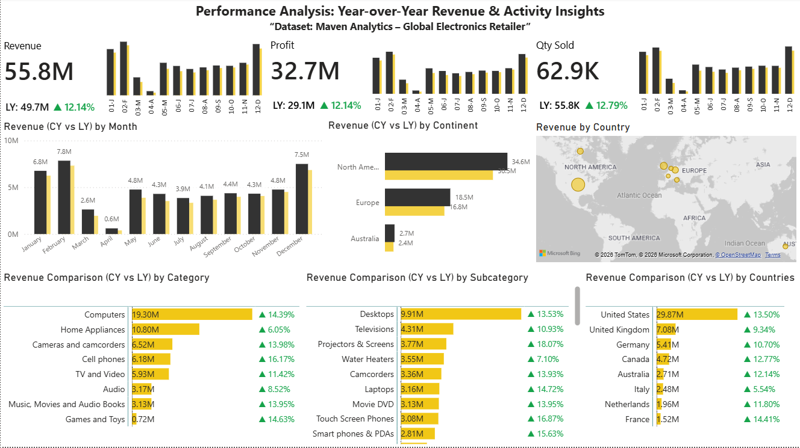

# powerbi-retail-performance-dashboard
Power BI dashboard analyzing retail performance using year-over-year comparisons (CY vs LY)
# Power BI Dashboard: Retail Performance (CY vs LY Analysis)

## Overview
This project presents an interactive Power BI dashboard analyzing business performance using year-over-year (current year vs last year) comparisons.

The focus is on understanding how the business evolves over time rather than just looking at totals.

---

## Key Insights

- Revenue and profit trends highlight seasonality and growth patterns  
- Business activity is measured using transaction count (not just quantity sold)  
- Geographic analysis identifies top-performing markets  
- Category and subcategory breakdown reveals product-level performance  
- Year-over-year comparison helps distinguish real growth from seasonal changes  

---

## Features

- KPI cards with CY vs LY comparison  
- Monthly trend analysis with growth percentages  
- Geographic map (revenue by country)  
- Category, subcategory, and city-level insights  
- Clean executive-style dashboard design  

---

## Dataset

Source: Maven Analytics  
Dataset: Global Electronics Retailer  

---

## Tools Used

- Power BI Desktop  
- DAX (Data Analysis Expressions)  
- Data modeling (star schema)  

---

## Dashboard Preview

